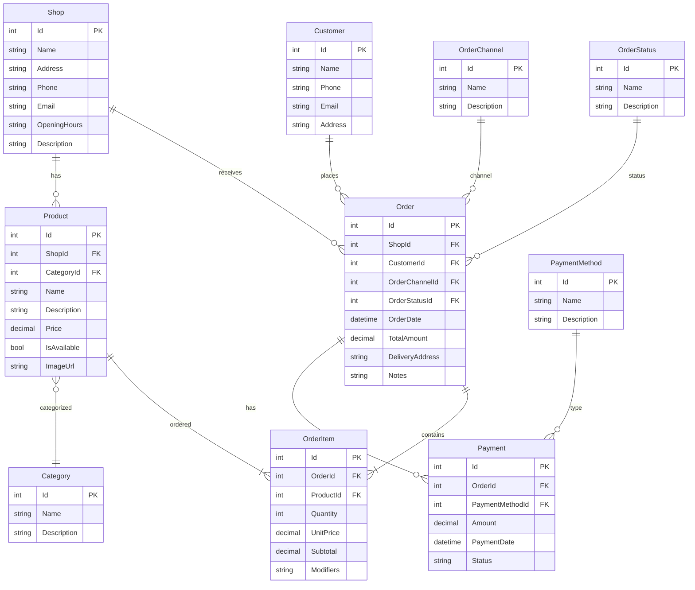

# Domain Model

```mermaid
erDiagram
    Shop ||--o{ Product : has
    Shop ||--o{ Order : receives
    Product }o--|| Category : categorized
    Customer ||--o{ Order : places
    OrderChannel ||--o{ Order : channel
    OrderStatus ||--o{ Order : status
    PaymentMethod ||--o{ Payment : type
    Order ||--o{ Payment : has
    Order ||--|{ OrderItem : contains
    Product ||--|{ OrderItem : ordered

    Shop {
        int Id PK
        string Name
        string Address
        string Phone
        string Email
        string OpeningHours
        string Description
    }

    Category {
        int Id PK
        string Name
        string Description
    }

    Product {
        int Id PK
        int ShopId FK
        int CategoryId FK
        string Name
        string Description
        decimal Price
        bool IsAvailable
        string ImageUrl
    }

    Customer {
        int Id PK
        string Name
        string Phone
        string Email
        string Address
    }

    OrderChannel {
        int Id PK
        string Name
        string Description
    }

    OrderStatus {
        int Id PK
        string Name
        string Description
    }

    PaymentMethod {
        int Id PK
        string Name
        string Description
    }

    Payment {
        int Id PK
        int OrderId FK
        int PaymentMethodId FK
        decimal Amount
        datetime PaymentDate
        string Status
    }

    Order {
        int Id PK
        int ShopId FK
        int CustomerId FK
        int OrderChannelId FK
        int OrderStatusId FK
        datetime OrderDate
        decimal TotalAmount
        string DeliveryAddress
        string Notes
    }

    OrderItem {
        int Id PK
        int OrderId FK
        int ProductId FK
        int Quantity
        decimal UnitPrice
        decimal Subtotal
        string Modifiers
    }
```
