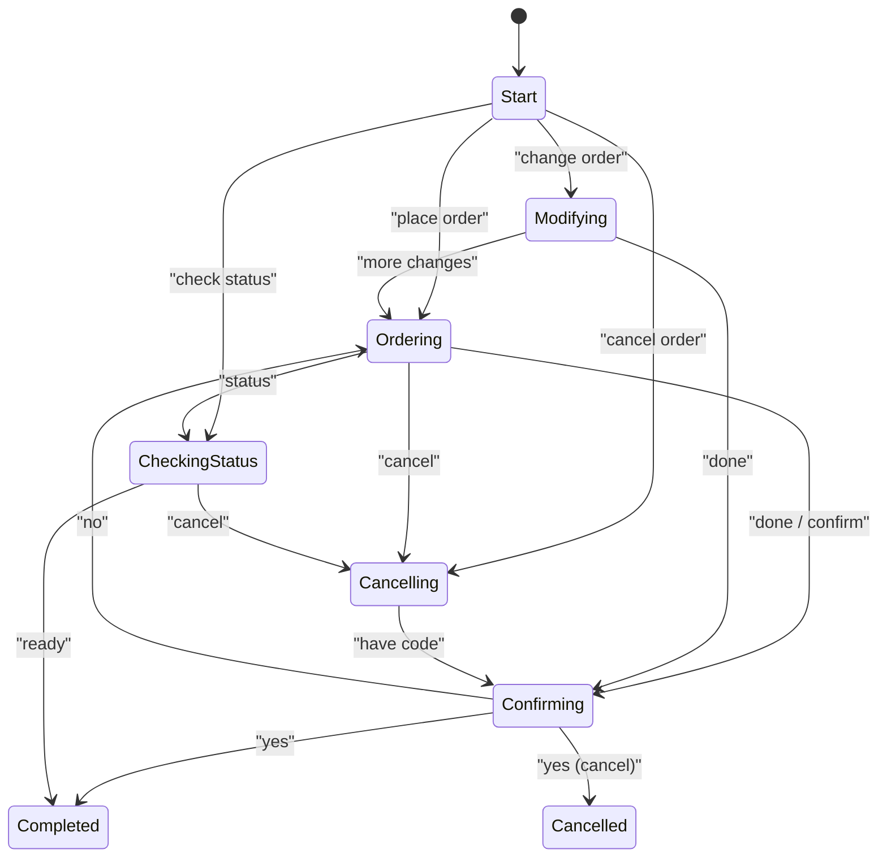

# Voice Dialog Finite State Machine

## Overview
The voice ordering endpoint now orchestrates customer interactions through a finite-state machine (FSM). The FSM tracks what the caller is trying to accomplish—placing a new order, modifying an existing one, cancelling, or checking status—and chooses the next prompt accordingly. Sessions are stored between turns so that every utterance builds on the prior context instead of starting fresh.

## Architecture
- `VoiceDialogStateMachine` encapsulates states, transitions, and heuristics for interpreting user utterances.
- `VoiceDialogSession` stores the caller identifier, dialog state, and conversational context (requested items, last prompt, derived metadata).
- `IVoiceDialogSessionStore` abstracts session persistence. The initial implementation (`InMemoryVoiceDialogSessionStore`) keeps sessions in a concurrent dictionary with idle expiration.
- `VoiceEndpoints` resolves the session store and state machine, transcribes audio when needed, executes the FSM, and synthesizes the next prompt.
- `Program.cs` registers all dialog services with the ASP.NET Core dependency injection container.

## Integration Steps
1. **Register services** – `Program.cs` adds `IVoiceDialogStateMachine` and `IVoiceDialogSessionStore` to DI so they can be injected anywhere.
2. **Process requests** – `VoiceEndpoints` validates input, loads the caller’s session, transcribes audio (if supplied), runs the FSM, and turns the resulting prompt into audio via the existing TTS client.
3. **Persist state** – Sessions are saved after each turn and cleared when the FSM reports completion or cancellation.
4. **Surface metadata** – `VoiceSessionResponse` now includes dialog state, prompt text, completion flag, and metadata map so clients can render UI hints or call downstream services.

## Follow-up Ideas
- Replace keyword heuristics with intent classification from the speech recognition transcript.
- Add persistent session storage (e.g., Redis) and eviction policies shared across instances.
- Expand metadata to include structured order details compatible with the ordering backend.
- Emit analytics events whenever transitions occur for monitoring and training data.
